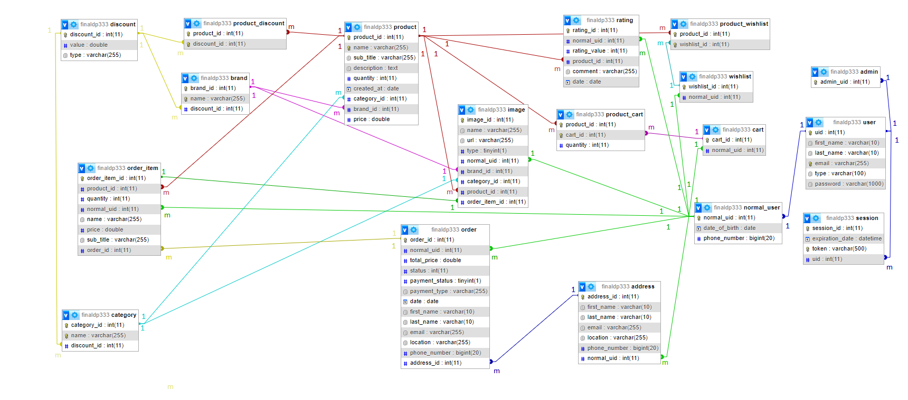

# Database Schema

# **The ER Digram :**

## Tables and there description

1. **Users Table (user):**
    - **uid**: Unique user identifier (primary key).
    - **first_name**: First name of the user.
    - **last_name**: Last name of the user.
    - **email**: Email address of the user (unique).
    - **type**: Type of user (normal_user, admin).
    - **password**: User's password.
    
2. **Normal Users Table (normal_User):**
    - **normal_uid**: Unique identifier for normal users (primary key, foreign key to **user** table).
    - **date_of_birth**: Date of birth of the normal user.
    - **phone_number**: Phone number of the normal user.
    
3. **Address’ Table (address):**
    - **address_id**: Unique address identifier (primary key).
    - **first_name**: First name associated with the address.
    - **last_name**: Last name associated with the address.
    - **email**: Email associated with the address.
    - **location**: Address location.
    - **phone_number**: Phone number associated with the address.
    - **normal_uid**: Foreign key referencing the **normal_User** table.
    
4. **Admins Table (admin):**
    - **admin_uid**: Unique identifier for admin users (primary key, foreign key to **user** table).
5. **Discounts Table (discount):**
    - **discount_id**: Unique discount identifier (primary key).
    - **value**: Discount value (e.g., percentage).
    - **type**: Type of discount.
    
6. **Brands Table (brand):**
    - **brand_id**: Unique brand identifier (primary key).
    - **name**: Name of the brand (unique).
    - **discount_id**: Foreign key referencing the **discount** table.
    
7. **Carts Table (cart):**
    - **cart_id**: Unique cart identifier (primary key).
    - **normal_uid**: Foreign key referencing the **normal_User** table.
    
8. **Categories Table (category):**
    - **category_id**: Unique category identifier (primary key).
    - **name**: Name of the category (unique).
    - **discount_id**: Foreign key referencing the **discount** table.
    
9. **Products Table (product):**
    - **product_id**: Unique product identifier (primary key).
    - **name**: Name of the product (unique).
    - **sub_title**: Subtitle or additional information about the product.
    - **description**: Description of the product.
    - **quantity**: Available quantity of the product.
    - **created_at**: Date when the product was created.
    - **category_id**: Foreign key referencing the **category** table.
    - **brand_id**: Foreign key referencing the **brand** table.
    - **price**: Price of the product.
    
10. **Orders Table (order):**
    - **order_id**: Unique order identifier (primary key).
    - **normal_uid**: Foreign key referencing the **normal_User** table.
    - **total_price**: Total price of the order.
    - **status**: Order status.
    - **payment_status**: Payment status of the order.
    - **payment_type**: Payment type used for the order.
    - **date**: Date of the order.
    - **first_name**: First name associated with the order.
    - **last_name**: Last name associated with the order.
    - **email**: Email associated with the order.
    - **location**: Location associated with the order.
    - **phone_number**: Phone number associated with the order.
    - **address_id**: Foreign key referencing the **address** table.
    
11. **Items of the Orders Table (order_item):**
    - **order_item_id**: Unique order item identifier (primary key).
    - **product_id**: Foreign key referencing the **product** table.
    - **quantity**: Quantity of the product in the order.
    - **normal_uid**: Foreign key referencing the **normal_User** table.
    - **name**: Name of the product in the order.
    - **price**: Price of the product in the order.
    - **sub_title**: Subtitle or additional information about the product.
    - **order_id**: Foreign key referencing the **order** table.
    
12. **Images Table (image):**
    - **image_id**: Unique image identifier (primary key).
    - **name**: Name of the image.
    - **url**: URL of the image.
    - **type**: Type of the image (e.g., user, brand, category, product, order item).
    - **normal_uid**: Foreign key referencing the **normal_User** table.
    - **brand_id**: Foreign key referencing the **brand** table.
    - **category_id**: Foreign key referencing the **category** table.
    - **product_id**: Foreign key referencing the **product** table.
    - **order_item_id**: Foreign key referencing the **order_item** table.
    
13. **Products at Carts Table (product_cart):**
    - **product_id**: Foreign key referencing the **product** table.
    - **cart_id**: Foreign key referencing the **cart** table.
    - **quantity**: Quantity of the product in the cart.
    - (Unique constraint on **product_id** and **cart_id**).
    
14. **Product Discounts Table (product_discount):**
    - **product_id**: Foreign key referencing the **product** table.
    - **discount_id**: Foreign key referencing the **discount** table.
    - (Unique constraint on **product_id** and **discount_id**).
    
15. **Wishlists Table (wishlist):**
    - **wishlist_id**: Unique wishlist identifier (primary key).
    - **normal_uid**: Foreign key referencing the **normal_User** table.
    
16. **Products of the Wishlists Table (product_wishlist):**
    - **product_id**: Foreign key referencing the **product** table.
    - **wishlist_id**: Foreign key referencing the **wishlist** table.
    - (Unique constraint on **product_id** and **wishlist_id**).
    
17. **Ratings Table (rating):**
    - **rating_id**: Unique rating identifier (primary key).
    - **normal_uid**: Foreign key referencing the **normal_User** table.
    - **rating_value**: Numeric value representing the rating.
    - **product_id**: Foreign key referencing the **product** table.
    - **comment**: User's comment about the product.
    - **date**: Date of the rating.
    
18. **Sessions Table (session):**
    - **session_id**: Unique session identifier (primary key).
    - **expiration_date**: Date and time when the session expires.
    - **token**: Unique token for the session (unique constraint).
    - **uid**: Foreign key referencing the **user** table.