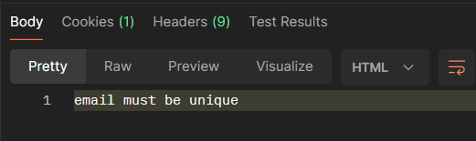

# User

**The main-Rout ⇒ Host+/auth**

**ALL the following routes should start with /auth**

⇒ **[http://158.176.1.165:3000](http://158.176.1.165:3000/)/auth**

**The description of the parameters in the routes are in :**

[Description for the parameters and query and the body in the routes](Description%20for%20the%20parameters%20and%20query%20and%20the%20b%20163650cd02b04a1ea09769b0e4f7f5f4.md)

<aside>
📢 **ALL the routes below except /register and /login need to send session-token in the cookies**

**example ⇒  “session-token=d7bdf711-9abe-4355-9bf0-7a377ed4f8dd”**

</aside>

---

## Create Account

Method ⇒ POST

```jsx
"/register"
```

send a body with the requestt

he body ⇒

```
{
    "email":"",
    "first_name":"",
    "last_name":"",
    "password":""
}
```

The response ⇒

- status 400
    - for the input validation
    - if the email has been used before with massage ⇒ email must be unique
        
        
        
- status 500 if server error happened
- status 200 it will
    
     return ⇒ true
    
    and it will set a session-token in the cookies 
    
    
    

---

## Login

Method ⇒ POST

```jsx
"/login"
```

send a body with the request

the body ⇒

```
{
    "email":"",
    "first_name":"",
    "last_name":"",
    "password":""
}
```

The response ⇒

- status 400
    - for the input validation
    - if the email or the password or both are wrong it will return  ⇒ Invalid Data Try Again
    
    
    
- status 200 it will
    
    return ⇒ true
    
    and it will set a session-token in the cookies 
    
    
    

---

## Edit user info

Method ⇒ patch

```jsx
"/editInfo"
```

send a body with the request

the body ⇒

should have at least one of the parameters ( “phone_number” , “email”, “first_name”, “last_name”,”date_of_birth”)

```json

 {
"phone_number":",
"email":"",
"first_name":"",
"last_name":"",
"date_of_birth":""
}
```

The response ⇒

- status 400
    - for the input validation
    - if the email or the password or both are wrong it will return  ⇒ Invalid Data Try Again
    
    
    
    - Status 200 it will return the data of the user:
    
    
    

---

## Upload image or edit image of the user

Method => POST

Content-Type: multipart/form-data

the image file should be jpg or jpeg

Content-Disposition: form-data; name="images"; 

Content-Type: image/png

```json
"/upload-image"
```

The response ⇒

- status 400
    - for the input validation
- Status 500 for server error
- status 200
    - will return the url of the image
    
    
    

---

## Delete User Image

Method ⇒ DELETE

```jsx
"/delete-image"
```

The response ⇒

- status 400
    - for the input validation
- Status 500 for server error
- status 200 will return true

---

## Get User Info

Method ⇒ GET

```jsx
"/user-info"
```

The response ⇒

- Status 500 for server error
- status 200 will return user info
    
    ```json
    {
        "date_of_birth": "2000-03-05",
        "first_name": "Isabella",
        "last_name": "Scott",
        "email": "cosmic_explorer78@emailservice.com",
        "phone_number": 8662565435
    }
    ```
    

---

## Change Password

Method ⇒ Patch

```jsx
"/change-password"
```

send a body with the request

body ⇒

```jsx
{
     "old_password":"",
      "new_password":"",
       "confirm_password":""
}
```

The response ⇒

- Status 500 for server error
- Status 400:
    - for input validation
    - when the old-password is wrong ⇒ it will return ⇒ Invalid password
    - when the new password and the confirm password are not equal ⇒ it will return ⇒ NewPass and the confirm pass are not the same
- status 200 and will clear the session-token in the cookies

---

## ADD Review to a product

method ⇒ POST

```jsx
"/add-reviews"
```

send a body with the request

body ⇒

```jsx
{
"comment":"",
"rating_value":x,
"product_id":x
}
```

change x to a number

- Status 500 for server error
- Status 400:
    - for input validation
    - when the product is not found it will return ⇒ product not found
- status 200 it will return ⇒

```jsx
{
    "date": "2024-01-29",
    "rating_value": 2,
    "product_id": 5,
    "comment": "this product is so good"
}
```

---

## Get User Reviews

Method⇒ GET

```json
"/reviews"
```

<aside>
📢 Note the user can add just one review in a product when attempt to add another reviews it will not add the review or edit the old one and it will return status 200 and with the old added review

</aside>

Response:

- Status 500 for server error
- status 200 it will return:
    
    ```json
    [
       
        {
    				"product_id": 2,
            "rating_id": 335,
            "comment": "Sleek and modern design. A must-have for those who appreciate aesthetics.",
            "rating_value": 2
        },
        {
    				"product_id": 4,
            "rating_id": 344,
            "comment": "Attention-grabbing design. Perfect for those who appreciate unique products.",
            "rating_value": 5
        },
        {
    				"product_id": 5,
            "rating_id": 350,
            "comment": "this product is so good",
            "rating_value": 2
        }
    ]
    ```
    

---

## Logout

Method⇒ POST

```jsx
"/logout"
```

- Status 500 for server error
- status 200 ⇒ will clear the session token in the cookies